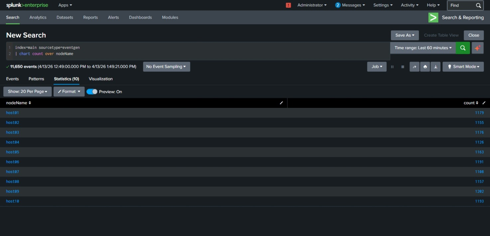
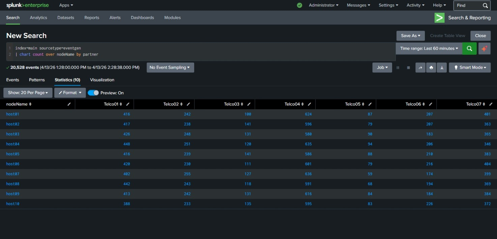

# Chart & Timechart Commands

---

## Chart — Single Series
(Chart - stats function- over - field)
### Purpose
Convert events into a table for comparing categories.

### Key Points
- Requires a stats function (count, avg, sum, etc.)
- Requires a split-by field
- Output is a table, not a visualization by itself

### Example Query
index=main sourcetype=eventgen
| chart count by NodeName

---

## Chart — Multi Series
( chart-stats function-over-field1-by-field2)
### Purpose
Compare multiple categories at once.

### Key Points
- Adds a second split-by field
- Table expands horizontally
- Useful for comparing actions within users

### Example Query
index=main sourcetype=eventgen
| chart count over nodeName by partner

---

## Timechart — Single Series

### Purpose
Create a time-series line chart.

### Key Points
- Automatically bins events by time
- Great for trends, spikes, anomalies
- Only one series unless you add a split-by

### Example Query
index=main sourcetype=eventgen
| timechart count

---

## Timechart — Multi Series

### Purpose
Trend multiple categories over time.

### Key Points
- Split-by creates multiple lines
- Good for comparing users or actions over time

### Example Query
index=main sourcetype=eventgen
| timechart count by user

---

## Common Options (Used in Both Commands)

span=1h  
limit=5  
useother=f

### Example
index=main sourcetype=eventgen
| timechart span=30m count by action limit=5 useother=f

---

## When to Use Which
- chart → category comparison (table)
- timechart → trends over time (line chart)
