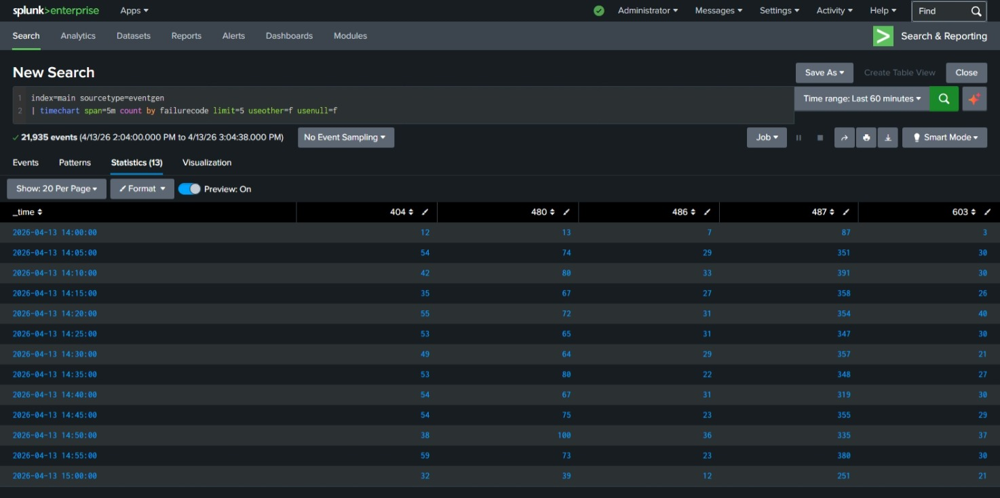
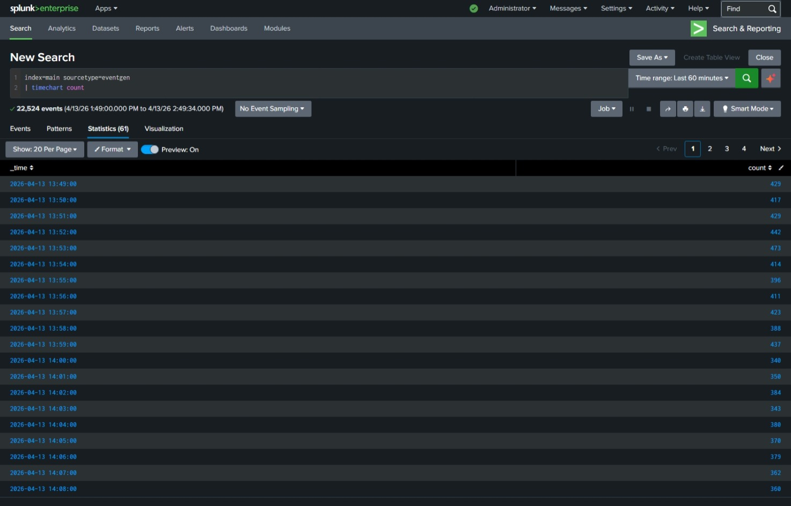

# Advanced Visualizations (Videos 19–21)

## 19. Scatter & Bubble Charts
Scatter and bubble charts help visualize relationships between numeric fields.

### Scatter Chart Example
index=security sourcetype=wineventlog:security
| stats count by src_ip dest_port

### Bubble Chart Example
index=security sourcetype=wineventlog:security
| stats count by user dest

### Screenshot

---

## 20. Formatting Statistics Tables
Formatting statistics tables makes data easier to read and present.

### Common Formatting Options
- rename fields
- round numeric values
- sort rows
- choose which columns to show
- create calculated fields

### Example
index=security sourcetype=wineventlog:security
| stats count avg(duration) as avg_duration by user
| eval avg_duration=round(avg_duration,2)
| rename user as "User", avg_duration as "Avg Duration (sec)"
| sort - avg_duration

### Screenshot

---

## 21. Formatting Visualizations
Formatting visualizations allows you to control how charts appear in Splunk.

### Key Formatting Areas
- Titles
- Axis labels
- Colors
- Legend placement
- Chart type switching
- Drilldown behavior

### Example
index=security sourcetype=wineventlog:security
| timechart count by user

### Screenshot

---

# Module 2 Complete
You have now finished:
- Transforming commands
- Chart
- Timechart
- Advanced visualizations
- All screenshots
- Clean Markdown
- Professional repo structure
